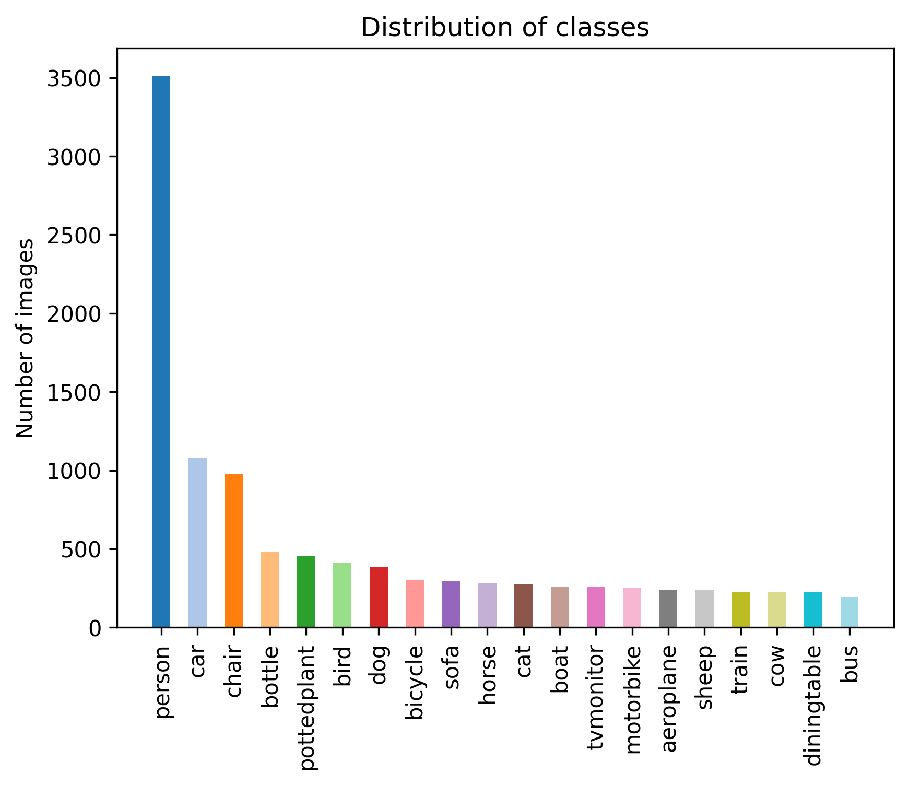

# <span style="color:#237094;">Object Detection for Visually Impaired</span>

  

## Table of Contents

<p>
<span style="color:#fb8509;">1.</span> <a href="#about">About</a><br>
<span style="color:#fb8509;">2.</span> <a href="#dataset">Dataset</a><br>
<span style="color:#fb8509;">3.</span> <a href="#methodology">Methodology</a><br>
&nbsp;&nbsp;&nbsp;&nbsp;<span style="color:#fb8509;">3.1.</span> <a href="#model_tuning">Model Tuning</a><br>
&nbsp;&nbsp;&nbsp;&nbsp;<span style="color:#fb8509;">3.2.</span> <a href="#model_training">Model Training</a><br>
&nbsp;&nbsp;&nbsp;&nbsp;<span style="color:#fb8509;">3.3.</span> <a href="#model_evaluation">Model Evaluation</a><br>
&nbsp;&nbsp;&nbsp;&nbsp;<span style="color:#fb8509;">3.4.</span> <a href="#model_testing">Model Testing</a><br>
<span style="color:#fb8509;">4.</span> <a href="#real_time_predictions">Real Time Predictions</a><br>
<span style="color:#fb8509;">5.</span> <a href="#challenges">Challenges</a><br>
<span style="color:#fb8509;">6.</span> <a href="#conclusions">Conclusions</a><br>
<span style="color:#fb8509;">7.</span> <a href="#future_work">Future Work</a><br>
<span style="color:#fb8509;">8.</span> <a href="#references">References</a><br>
<span style="color:#fb8509;">9.</span> <a href="#contributors">Contributors</a><br>
</p>

## <span id="about" style="color:#00bbd6;">1. About</span>

This project looks to improve the life quality of visually impaired individuals by helping them understand their surroundings better by leveraging machine learning to **detect object** present in the field of view. This project contains the tuning and training of the model on the [Pascal VOC Dataset](http://host.robots.ox.ac.uk/pascal/VOC/voc2007/index.html) which contains labeled images of 20 different classes followed by identifying images real-time using our webcam or simulating it using images/videos.

## <span id="dataset" style="color:#00bbd6;">2. Dataset</span>

The Pascal VOC dataset used has the following 20 classes:

-   **Person***:* person

-   **Animal***:* bird, cat, cow, dog, horse, sheep

-   **Vehicle***:* aeroplane, bicycle, boat, bus, car, motorbike, train

-   **Indoor***:* bottle, chair, dining table, potted plant, sofa, tv/monitor

A total of 5008 images are used for training the model. The frequency distribution of the classes in the images can be seen below:

\######################## Add image

It can be seen that there is a class imabalanced. Due to this, it is best to use mAP (mean average precision) metric to asses the performance of the model.

## <span id="methodology" style="color:#00bbd6;">3. Methodology</span>

The dataset used has 5008 images. This has been split to 70% train, \@20% valid and 10% test data. The annotations were originally in XML format, this was converted to .txt format using Roboflow.

###  <span id="model_tuning" style="color:#5fa8d3;">3.1 Model Tuning</span>

Parameters such as learning rate, image size, momentum and weight decay were tuned.

```{python}     learning_rate = trial.suggest_loguniform('learning_rate', 1e-5, 1e-1)     img_size = trial.suggest_categorical('img_size', [320, 416, 512, 640]) # Common yolo image size     momentum = trial.suggest_uniform('momentum', 0.85, 0.99)  # Typical range for momentum     weight_decay = trial.suggest_loguniform('weight_decay', 1e-6, 1e-2)}
```

Hyperparameter tuning was done using the **optuna** library. The parameters were set in a range and during the tuning, the parameters are selected randomly from the range and train the model with the selected parameters. This was done for 10 trials. This method was mainly followed due to hardware constraints and to get an idea of what range hyperparameters will be suitable for the problem. The set of parameters which maxmimises the mAP was selected to train the final model.

###  <span id="model_training" style="color:#5fa8d3;">3.2 Model Training</span>

The model is then trained for 100 epochs with the selected hyperparameters using the optimizer 'AdamW'. Some layers were also frozen as a pre-trained model and to not lose whatever information was learned.

###  <span id="model_evaluation" style="color:#5fa8d3;">3.3 Model Evaluation</span>

The confusion matrix, performance metrics like mAP, precision and recall were looked at. The confusion matrix can be seen below:


The “train” class is the most accurate predication, 90% of the instances are classified accurately. The “aeroplane” class is a close second. Among 20 classes, only 4 classes (boat, bottle, chair, potted plant) have the correct prediction class proportion to be less than 0.65. This could be due to the complexity and the nature of the objects that the recall for these are relatively lower.

The performance metrics can be seen below:


The model performs well with mAP (mean average precision) of 0.746 for all classes. Due to class imbalance, it is best to evaluate the model using mAP as it takes into account of Precision and Recall metrics. Each class has mAP of at least 0.6 except for ‘potted plant’ class which is around 0.48. As mentioned above, this is probably because of the lower number of instances and how potted plants can come different varieties of sizes and shapes.

A visualisation of the above metrics are also shown below:


###  <span id="model_testing" style="color:#5fa8d3;">3.4 Model Testing</span>

The trained model was also then used to detect and predict the objects in the test data. An image was created which combines multiple predictions and compares it with the original annotations. The image is shown below:


It can be seen that the detections are very accurate. The model can be further improved upon by letting it be tuned further with a bigger hyperparameter space and using a more complex model YOLOv8 model such as the YOLOv8m or YOLOv8l.

## <span id="real_time_predictions" style="color:#00bbd6;">4. Real Time Predictions</span>

Now that the model has been trained, we can use it to do real time object detection using our webcam. The weights for the model are present in the file ".\runs\detect\train7\weights\best.pt". 

To use these weights and detect objects in real time, follow the below steps:

### Step 1: Clone the project

For cloning the project, navigate to the required folder in your local system and run the below command:

````bash
git clone https://github.com/ACM40960/project-SurajSuman.git
````

### Step 2: Installing the required packages

Install all the python packages required. It is recommended to create a separate environment to avoid any conflicts.

````bash
pip install requirements.txt
````

### Step 3: Running the script (webcam required)

To start the real time detection, run the **"predict.py"** script using the below command:

````bash
python predict.py
````

This will turn the webcam on and start detect any object out of the 20 classes on which it has been trained

### Step 4: Detecting objects on images and videos

In case you don't have access to a webcam, you can run the detection model on images and videos present in your system. For this, open the **"predict.py"** script and change the source from '0' to the path of your image/video

````bash
model.predict(source=0, show=True, save=True, conf=0.5)
# Change the 0 in 'source=0' to source='<path>'
````

## <span id="challenges" style="color:#00bbd6;">5. Challenges</span>

- **Imbalanced Dataset:** Datasets play a huge role in the performance of a model. An imbalanced dataset can can lead to biased models and inaccurate predictions. We had dabbled with a few different datasets but finally went forward with the **'Pascal VOC Dataset'** as we found it was the least imbalanced among the datasets we had tested. Below is the distribution of the different classes in the dataset for training data.



- **Limited Computating Resources-**